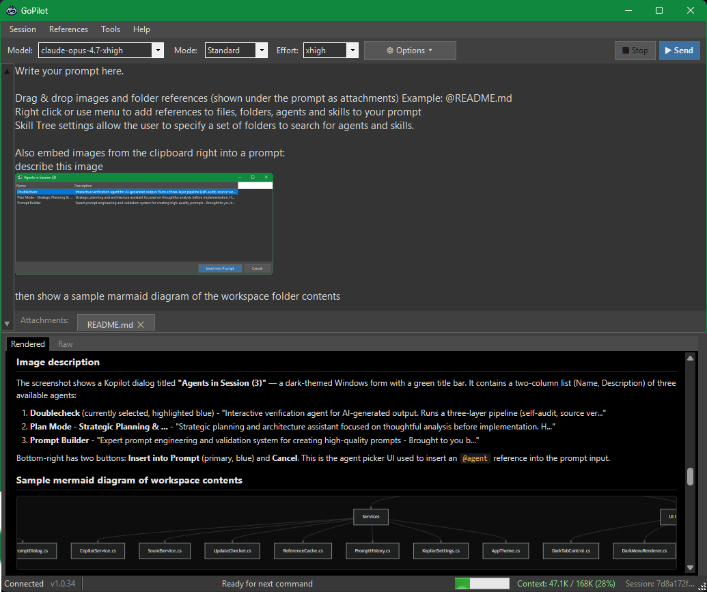

# GoPilot

**GoPilot** is a Windows desktop GUI for the [GitHub Copilot SDK](libs/copilot-sdk). It wraps the Copilot CLI experience in a friendly WinForms interface so you can chat with Copilot, approve tool operations, and manage your session — all without leaving a graphical window.

---



---

## Features

- Multi-line prompt editor — Enter inserts a newline; Ctrl+Enter (or the Send button) submits, so prompts are never sent by accident.
- Drag & drop files or folders onto the prompt from File Explorer or the Visual Studio Solution Explorer. Right-click to insert file, folder, skill, or agent references.
- Paste images from the clipboard directly into a prompt (with preview); attached as PNGs on send and echoed as inline thumbnails beneath your prompt in the output panel.
- Browse, resume, and bulk-delete previous sessions from the Past Sessions dialog.
- Context is automatically carried into a fresh session when Model, Mode, Fleet, or the Skill Tree changes.
- Optional Caveman mode to reduce tokens on both input (client-side rewrite) and output (model directive).
- Rendered and Raw output tabs — Markdown, Mermaid diagrams, and syntax-highlighted code in Rendered; plain transcript in Raw.
- Pan and zoom for oversized content — Mermaid diagrams, wide code blocks, and large tables get a scrollable, zoomable viewport with a fullscreen mode.
- Accurate context meter (green / amber / red) with an offer to compact or restart when usage crosses 85%.
- Manual session refresh — fast in-place compact, restart-with-summary (saved as a dream file), or fresh start with no carry-over.
- Skill Tree — an ordered list of folders that contribute `skills/`, `agents/`, and a silent `gopilot-instructions.md` to every session.
- Custom agents and skills are auto-discovered from the Skill Tree and inserted as `@agent:name` / `@skill:name` tokens via picker dialogs.
- Plan and Autopilot modes in addition to Standard conversational chat.
- Fleet mode for spawning parallel sub-agents on large, decomposable tasks.
- Tool permission dialog with Allow / Approve Similar / Deny, plus an Auto-approve toggle for trusted runs.
- Prompt history navigation with the ▲ / ▼ buttons beside the prompt box.
- Quick-launch external tools rooted at the workspace — PowerShell, File Explorer, and VS Code.
- Dark theme throughout — menus, tabs, dialogs, and the rendered output panel.
- CLI launch argument to open and connect to a workspace folder at startup.
- On-demand session summarize (Session ▸ 📝 Summarize) to capture progress before switching topics.
- Self-update check with an in-app notification when a new release is available.

## Why this exists

This is intended as an aide for my own personal workflow using Copilot CLI. I find it difficult to work in the terminal, so I built a Windows app that makes it easier for me to edit prompts, save and restore session state, launch tools within the workspace, etc.

Think of this as an alternate front-end for the Copilot CLI for people too accustomed to using standard Windows forms and editors. :)

## Did Copilot write GoPilot?

Mostly yes. This is a Copilot CLI generated tool to make the Copilot CLI easier to use (for me).

## Requirements

- Windows 10 or later
- [.NET 8.0 Runtime](https://dotnet.microsoft.com/download/dotnet/8.0)
- A GitHub account with Copilot access (authenticated via `gh` CLI or environment)

---

## Getting Started

1. **Build** the solution:
   ```
   dotnet build GoPilot.sln
   ```

2. **Run** the app:
   ```
   dotnet run --project GoPilot/GoPilot.csproj
   ```
   Or launch the compiled executable directly from `GoPilot/bin/`.

   You can optionally pass a workspace folder path as the first argument to
   open and connect to it automatically at launch (equivalent to choosing
   **Session ▸ 📂 New Session…** on that path):
   ```
   GoPilot.exe C:\path\to\my\project
   ```

3. **Connect to a project folder:**
   Choose **Session ▸ 📂 New Session…** and select your working directory. This establishes a Copilot session rooted at that folder.

4. **Start chatting:**
   Type your prompt and press **Send** (or `Ctrl+Enter`).

---

## User Interface

### Main Window

The window has three horizontal bands:

- **Menu bar** (top) — Session, References, Tools, Help
- **Top panel** — prompt input and session controls
- **Bottom panel** — streaming output from Copilot
- **Status bar** — connection, version, agent activity, context meter

---

### Menu Bar

All session-level actions live in the menu bar. Most items have tooltips describing their behaviour.

#### **Session** menu

| Item | Description |
|---|---|
| **📂 New Session…** | Pick a workspace folder and start a fresh Copilot session rooted at it. Required before sending prompts. |
| **📋 Past Sessions…** | Browse all persisted Copilot sessions to resume one or delete one or more. See [Past Sessions](#past-sessions). |
| *— separator —* | |
| **📝 Summarize** | Request a summary of the session so far. |
| **🗑 Clear Output** | Clear the output panel (asks for confirmation). The session itself is not reset. |
| **💤 Refresh ▸** | Submenu — free up context window. See [Refreshing the Session](#refreshing-the-session). |

The **Refresh** submenu offers:

| Item | What it does |
|---|---|
| **⚡ Compact (fast, keeps session)** | In-place history compaction; session ID preserved. |
| **🔄 Restart with summary (clean window)** | Save a dream file, open a fresh session, seed it with the summary. |
| **🆕 Fresh start (no carry-over)** | Discard all context; open a brand-new session in the same folder. |

#### **References** menu

| Item | Description |
|---|---|
| **📄 Add File…** | Attach one or more files to the next prompt. |
| **📁 Add Folder…** | Attach a folder to the next prompt. |
| **List Agents…** | Open the **Agents in Session** picker — all custom agents from the current Skill Tree, project, and personal folders. Selecting one inserts an `@agent:name` reference at the prompt caret. |
| **List Skills…** | Open the **Skills in Session** picker. Selecting a row inserts `@skill:name` at the prompt caret. |
| **List Prompts…** | Open the **Prompts in Session** picker. Selecting a row attaches the underlying `prompts/<name>.md` file to the next prompt the same way **Add File…** does — a chip appears in the attachments strip and a relative-path `@…/prompts/<name>.md` token is inserted at the prompt caret. |

Attached files and folders appear as chips above the output panel and are also inserted as `@relative/path` tokens at the prompt caret.

#### **Tools** menu

| Item | Description |
|---|---|
| **⚡ PowerShell** | Open a PowerShell terminal in the current project folder (loads `scripts.ps1` if present). |
| **📂 File Explorer** | Open File Explorer at the current project folder. |
| **💻 VS Code** | Launch VS Code in the project folder. (Live IDE pairing — the Copilot CLI's `/ide` command — is not available through the Copilot SDK, so this only opens the editor.) |
| **🌳 Skill Tree…** | Edit the ordered list of folders contributing `skills/` and `agents/` to every session. See [Skill Tree](#skill-tree). |

#### **Help** menu

| Item | Description |
|---|---|
| **❓ Show Help** | Ask Copilot to describe its own capabilities and available tools. |
| **About GoPilot** | Version, build info, and credits. |

---

### Top Toolbar

The controls immediately below the menu bar operate on the **current prompt** and session connection.

| Control | Description |
|---|---|
| **Model** | Choose the AI model: GPT-4.1, GPT-5, Claude Sonnet 4.5/4.6, Claude Opus 4.5, and others. |
| **Mode** | Execution mode — see [Modes](#modes) below. |
| **Effort** | Reasoning effort for the selected model (`Low` / `Medium` / `High` / `XHigh`). Auto-populated from the model's advertised capabilities and always defaults to the highest available level. Disabled when the model does not advertise reasoning-effort support. |
| **⚙ Options ▾** | Opens a dropdown of session toggles — see [Options Dropdown](#options-dropdown) below. |
| **⬛ Stop** | Cancel the current in-progress response. |
| **▶ Send** | Submit the current prompt. Shortcut: `Ctrl+Enter`. |

---

### Options Dropdown

The **⚙ Options ▾** button on the toolbar opens a dropdown of session toggles. Each entry is a check-on-click item; the check state is shown next to the label.

| Item | Default | Description |
|---|---|---|
| **Auto-approve tools** | ☑ On | Automatically approve all tool operations without showing the [Tool Permission Dialog](#tool-permission-dialog). |
| **Fleet mode** | ☐ Off | Enable Fleet mode to spawn multiple parallel sub-agents for complex tasks. See [Fleet Mode](#fleet-mode). Toggling mid-session triggers an automatic summary-and-restart handoff on the next send. |
| **🦴 Caveman Mode** | ☐ Off | Reduce each prompt to "caveman speak" client-side before sending, and ask the model to reply in the same primitive style. Persisted in `gopilot.ini`. See [Caveman Mode](#caveman-mode). |
| **👁 Show Working Steps** | ☐ Off | Keep Reasoning and Tool sections expanded in the **Rendered** output tab after they finish. When off, each section auto-collapses to a one-line summary once complete. Persisted in `gopilot.ini`. |

---

### Prompt Box

The large text area below the toolbar. Type your request here.

- Press **`Ctrl+Enter`** to send.
- **Drag and drop** files or folders directly onto the box to attach them. Sources include File Explorer and the Visual Studio Solution Explorer (items inside a `.csproj` are resolved to their absolute paths).
- Use the **▲ / ▼** history buttons on the left edge to navigate previously sent prompts.
- **Paste images** from the clipboard; they are extracted on send, attached as PNG files under `%TEMP%\GoPilot\`, and echoed as inline thumbnails beneath your prompt block in the **Rendered** output tab. The bytes travel to Copilot only as binary attachments (the markdown thumbnail is display-only and is not added to the prompt text, so it doesn't inflate token usage).

#### Right-click context menu

Right-click anywhere inside the prompt box to get the most-used reference commands without leaving the keyboard:

| Item | Action |
|---|---|
| **Cut** | Cut the current selection to the clipboard (`Ctrl+X`). |
| **Copy** | Copy the current selection to the clipboard (`Ctrl+C`). |
| **Paste** | Paste clipboard content — text, images, or files — at the caret (`Ctrl+V`). |
| **📄 Add File…** | Same as **References ▸ Add File…**. |
| **📁 Add Folder…** | Same as **References ▸ Add Folder…**. |
| **List Agents…** | Same as **References ▸ List Agents…**. |
| **List Skills…** | Same as **References ▸ List Skills…**. |
| **List Prompts…** | Same as **References ▸ List Prompts…**. |

---

### References in the prompt

GoPilot uses the `@` prefix for all inline references. References are inserted automatically (with surrounding whitespace) at the current caret position when you pick them through a menu, dialog, or drag-and-drop.

| Reference | How to insert | Meaning |
|---|---|---|
| `@relative/path/to/file.ext` | References ▸ Add File… · right-click ▸ Add File… · drag-drop | Attach a file. A chip appears above the output. |
| `@relative/path/to/folder` | References ▸ Add Folder… · right-click ▸ Add Folder… · drag-drop | Attach a folder. A chip appears above the output. |
| `@agent:name` | References ▸ List Agents… · right-click ▸ List Agents… | Reference a custom agent registered in the current session. |
| `@skill:name` | References ▸ List Skills… · right-click ▸ List Skills… | Reference a skill discovered in the Skill Tree. |

**Attachment chips.** File and folder references also appear as labelled chips in the attachments strip above the output. Click a chip's **×** to remove both the chip and the corresponding `@path` token from the prompt. A silent attachment (`gopilot-instructions.md`) is sent without a chip or token.

---

### Agents / Skills / Prompts Picker Dialog

The **Agents in Session**, **Skills in Session**, and **Prompts in Session** dialogs (opened from the References menu or the right-click menu) show every custom agent / skill / prompt visible in the current session:

| Control | Action |
|---|---|
| **Double-click** a row | For agents/skills, insert `@agent:name` or `@skill:name` at the prompt caret and close. For prompts, attach the underlying file and insert its relative-path `@reference` at the caret, then close. |
| **Insert into Prompt** | Same as double-click on the selected row. |
| **Cancel** | Close the dialog without inserting. |
| **Right-click ▸ Show in Explorer** | Reveal the underlying agent `.md` file, `skills/<name>/SKILL.md`, or `prompts/<name>.md` on disk. |

---

### Output Panel

Displays the streaming Copilot response in real time. The panel has two tabs:

| Tab | Description |
|---|---|
| **Rendered** | Rich HTML view (WebView2). Markdown is parsed, code blocks are syntax-highlighted, and Mermaid diagrams are rendered as SVG. This is the default view. |
| **Raw** | Plain-text transcript in a classic RichTextBox. Useful for copying unformatted output, debugging, or as a fallback when the WebView2 runtime isn't available. |

Color coding (used in both tabs where applicable):

| Color | Meaning |
|---|---|
| 🔵 Blue | Your prompt |
| 🟢 Green | Copilot's response |
| 🟡 Yellow | Tool / operation activity |
| 🔴 Red | Errors |

#### Pan & zoom for large content (Rendered tab)

Mermaid diagrams, wide code blocks, and large tables are automatically wrapped in a scrollable, zoomable viewport so they fit the output window without losing detail. Hover over a diagram or oversized block to reveal a small floating toolbar in the top-right corner:

| Control | Action |
|---|---|
| **+** | Zoom in |
| **-** | Zoom out |
| **Fit** | Reset zoom and pan to the original fit |
| **Full** | Promote the block to a fullscreen overlay that fills the whole window |

Direct gestures are also supported:

- **Mouse wheel** — zoom in/out, centered on the cursor (range 0.1x–8x)
- **Left-drag** — pan the content
- **Double-click** — reset to the default fit
- **Esc** — exit fullscreen mode

A block is treated as "oversized" when it overflows the viewport width or exceeds roughly 480 px in height; Mermaid diagrams always get the zoomable wrap.

---

### Status Bar

The bar at the bottom of the window shows:

- **Connection status** — folder path once connected, or "Not connected"
- **Copilot version**
- **Agent status** — live activity message (e.g., "Ready for next command")
- **Context meter** — current prompt-token usage as `Prompt: 42K / 200K (21%)`. This uses the Copilot SDK's per-model prompt-token ceiling (which may be smaller than the vendor-published context window). Coloured green below 60%, amber at 60–85%, red above 85%.
- **Session info**

---

## Refreshing the Session

Long sessions accumulate context until model accuracy degrades. The **Session ▸ 💤 Refresh** submenu offers three ways to reclaim space without losing your place:

| Option | What it does | When to use |
|---|---|---|
| **⚡ Compact (fast)** | Calls the CLI's in-place compaction (`session.history.compact`). Session ID is preserved; conversation continues seamlessly. | First choice. Fast, cheap, keeps everything intact. |
| **🔄 Restart with summary** | Asks Copilot to write a one-page Markdown summary, saves it to `%LOCALAPPDATA%\GoPilot\workspaces\<key>\dreams\dream-{timestamp}.md`, opens a fresh session in the same folder, and seeds it with the summary. | When Compact isn't enough or you want a truly clean window. |
| **🆕 Fresh start (no carry-over)** | Discards all context with no summary, opens a brand-new session in the same folder, then offers to read the README — exactly like choosing **Session ▸ 📂 New Session…** on the current path. | When you want to switch tasks completely and start clean, with no memory of the previous conversation. |

When the context meter crosses **85%**, GoPilot automatically prompts you to choose Compact or Restart (or dismiss for the rest of the session). After either action, a `─── session refreshed ───` divider is written to the output panel — your transcript is never cleared.

**Automatic carry-over on option changes.** Switching **Mode** or toggling **Fleet** during an active session forces a new session (the system message is baked in at creation time). Rather than discarding context, GoPilot defers the reset: on your next send it runs the same summary-and-restart flow used by Refresh, then forwards your prompt to the fresh session. A dream file is saved under `%LOCALAPPDATA%\GoPilot\workspaces\<key>\dreams\` for each automatic handoff.

---

## Caveman Mode

Toggle **⚙ Options ▾ ▸ 🦴 Caveman Mode** to make GoPilot rewrite every prompt you send into a token-minimal "caveman" form before it reaches the model. The transform is deterministic, runs entirely client-side, and the reduced text is what appears in the output panel as your `👤 You:` echo — there is no hidden rewrite.

**What gets stripped**

- Articles and determiners — `a`, `an`, `the`
- Common prepositions — `of`, `in`, `on`, `at`
- Auxiliaries and modals — `is`, `are`, `was`, `were`, `be`, `been`, `being`, `will`, `would`, `could`, `should`, `shall`, `may`, `might`, `must`, `do`, `does`, `did`, `have`, `has`, `had`
- Filler words — `very`, `really`, `so`, `just`, `like`, `uh`, `um`, `ah`, `er`, `well`
- Pleasantries — `hi`, `hello`, `hey`, `thanks`, `please`, `cheers`, `sorry`, plus phrases `thank you`, `thank you very much`, `you're welcome`, `i'm sorry`, `i mean`, `you know`, `kind of`, `sort of`, `going to`, `able to`
- Dummy / expletive `it` before a copula or stative verb — `it is`, `it was`, `it's`, `it seems`, `it appears` (only the pronoun is dropped; referential `it` elsewhere and the possessive `its` are left intact)
- Sentence-initial subjects — leading `I`, `we`, `I'll`, `I'm`, `we'll`, `we're`
- `-ly` adverbs (with a small whitelist that keeps `only`, `early`, `likely`)
- Commas, semicolons, em/en dashes between words, and any non-ASCII decorative emoji
- `do/does/did not` (and `n't` contractions) collapse to a single `not`
- Polite-clause openers — `Could/Can/Would/Will you (please)`, `If you don't mind`, `If you could`, `If you would`
- Hedges — `I think/believe/guess/feel/suppose/reckon (that)`, `In my opinion`, `maybe`, `perhaps`, `possibly`, `probably`, `somewhat`, `presumably`, `arguably`
- Trailing punctuation runs (`!!!`, `???`, `?!?`, `...`) collapse to a single `?` (if the run contains `?`) or `.` otherwise
- Lines that contain only punctuation after stripping (e.g. `Thanks!` becoming a lone `!`) are dropped entirely

**What is preserved**

- Negations: `not`, `no`, `never`, `none`, `nothing`, `don't`, `won't`, `can't`, `cannot`
- Fenced code blocks (` ``` `), inline backticks (`` ` ``), `@references`, and URLs (`http://…`, `https://…`) are extracted, kept verbatim, and re-inserted after the rewrite
- **No-touch lines** — any line whose first non-whitespace characters are `!!` is passed through exactly as you typed it (with the `!!` marker stripped). Use this when one paragraph absolutely must reach the model unmodified.
- Line breaks are normalised to plain LF (`\n`); blank-line runs collapse to a single blank line

**What is converted**

- Digits one–twenty are written as `1`–`20`, plus `thirty`–`ninety` → `30`–`90`, and `hundred` / `thousand` / `million` / `billion` → `100` / `1000` / `1000000` / `1000000000`

**Reduction meter**

After every send, GoPilot writes a discreet meta line to the output panel showing the before/after character count, e.g. `🦴 Caveman: 142 -> 87 chars (-39%, saved 55)`. Use this to gauge whether the mode is actually helping for the prompts you write — for code-heavy prompts the saving will often be near zero.

**Caveats**

- Token savings on prompts are typically modest (around 10–20 % for prose-heavy prompts). For short prompts or those dominated by code/paths, savings may be near zero.
- Removing modals can subtly change tense or conditionality. If the AI starts asking unexpected clarifying questions, switch the mode off.
- The toggle is persisted in `gopilot.ini` under `[Caveman]` (`Enabled=true|false`).

**Effect on the model's replies**

Caveman is a two-sided agreement: it minimises **your** tokens by rewriting prompts client-side, and it asks the model to minimise **its** tokens by replying in the same primitive style.

- When the toggle is on, every new Copilot session GoPilot creates includes a `CAVEMAN MODE` directive in its system message instructing the model to reply with the same density rules, while preserving code, file paths, command syntax, and tool output verbatim. Because the directive is baked into the system message, it survives `Refresh ▸ Compact` and is re-applied on `Restart with summary` / `Fresh start`.
- Toggling Caveman **mid-session** does *not* force a session handoff. Instead, GoPilot sends a single side instruction (`CAVEMAN MODE ON.` or `CAVEMAN MODE OFF.`) so the model switches style on its very next reply. The instruction is visible in the transcript as a `👤 You:` block so you always know when the change took effect.

---


Every Copilot session GoPilot creates is given a stable, human-readable ID of the form `{LeafFolder}-{MM-dd-yyyy-HHmmss}` (e.g. `GoPilot-04-24-2026-211734`) and is persisted by the underlying Copilot SDK. GoPilot also records lightweight metadata about each session — workspace folder, model, mode, fleet flag, auto-approve flag, and creation timestamp — in a global `gopilot-sessions.json` file alongside `gopilot.ini` next to the executable.

Choose **Session ▸ 📋 Past Sessions…** to open the **Past Sessions** dialog, which combines browsing, resuming, and deleting in one place.

| Column | Meaning |
|---|---|
| **Session ID** | The custom session identifier. Your currently connected session is suffixed `(current)` and shown muted. |
| **Workspace** | The folder the session was rooted at. |
| **Model** | The AI model selected when the session was created. |
| **Mode** | Standard / Plan / Autopilot. |
| **Created** | Original creation timestamp. |

The dialog supports multi-selection. The status text in the bottom-left shows the current selection count.

| Button | Behaviour |
|---|---|
| **Resume** | Enabled only when exactly one row is selected (and it is not the current session). Switches the **Model** and **Mode** toolbar controls plus the **Fleet** and **Auto-approve** entries in the **⚙ Options ▾** dropdown back to their original values, opens the recorded workspace folder, reconnects via the SDK's `ResumeSessionAsync`, and replays the full conversation history into both the **Rendered** and **Raw** output tabs. The dialog then closes. Double-clicking a row is equivalent. |
| **Delete** | Enabled when at least one non-current row is selected. After confirmation, deletes each selected session from the Copilot SDK store, removes its scratch folder under `~/.copilot/session-state/<id>/` (best-effort; failures are silent), and drops the row from GoPilot's local metadata file. The dialog stays open so you can keep working. The `Delete` key is a shortcut. This action cannot be undone. |
| **Close** | Dismiss the dialog. `Esc` is a shortcut. |

The currently connected session is always shown for reference but is protected: neither **Resume** nor **Delete** will operate on it. To move on from the current session, start a new one (or use **Session ▸ 💤 Refresh ▸ 🆕 Fresh start**) first, then return to **Past Sessions** to delete the old one.

> **Pruning.** Whenever the dialog opens, GoPilot cross-references its local metadata against the SDK's live session list and silently drops any stale entries whose underlying session no longer exists.

---

## Modes

Select the execution mode from the **Mode** dropdown:

| Mode | Behaviour |
|---|---|
| **Standard** | Normal conversational chat. Copilot responds directly. |
| **Plan** | Copilot plans a sequence of actions before executing them. Good for complex multi-step tasks. |
| **Autopilot** | Fully autonomous execution with minimal prompting. Copilot decides and acts with little intervention. |

---

## Fleet Mode

When the **Fleet** checkbox is enabled, Copilot can spawn multiple parallel sub-agents to work on different parts of a task simultaneously. The output panel will show each agent's progress. The session completes when the last sub-agent finishes.

Best suited for large refactors, multi-file generation, or tasks that can be broken into independent workstreams.

---

## Skill Tree

The **Tools ▸ 🌳 Skill Tree…** menu opens a dialog where you can manage an ordered list of folders that contribute reusable assets to every Copilot session GoPilot starts.

For each folder in the list, when a session is created GoPilot looks for three subfolders:

| Subfolder | What GoPilot does with it |
|---|---|
| `skills/` | Added to the session's `skillDirectories`, exposing every skill it contains to Copilot. See [Custom skills](https://docs.github.com/en/copilot/how-tos/copilot-sdk/use-copilot-sdk/custom-skills). |
| `agents/` | Each `*.md` file is parsed into a `customAgent` definition (front-matter metadata plus the prompt body) and registered with the session. |
| `prompts/` | Each `*.md` file is registered as a named prompt template surfaced through **References ▸ List Prompts…**. Prompts are not registered with the SDK; selecting one attaches the underlying file to the next outgoing message exactly like **Add File…**. Optional YAML front matter (`name`, `description`) is honoured; the file stem is used as the name otherwise. |

A `gopilot-instructions.md` file at the root of a Skill Tree folder is also concatenated into the system message.

The list is persisted to `gopilot.ini` under a `[SkillTree]` section, e.g.:

```
[SkillTree]
Folder=C:\copilot\team-shared
Folder=C:\copilot\my-personal
```

**Dialog controls:**

| Button | Action |
|---|---|
| **Add...** | Pick a folder with the standard browse dialog and append it to the list. |
| **Remove** | Remove the selected folder from the list. |
| **Move Up / Move Down** | Reorder entries. Order matters: later entries override earlier ones for agent-name collisions, and the project folder always wins overall. |
| **OK** | Persist the change and trigger a session refresh. |
| **Cancel** | Discard the edits. |

Skill Tree folders do **not** need to end in `.github` — point at any folder you like. The `skills/`, `agents/`, and `prompts/` subfolders are detected case-insensitively (Windows file system).

> **Session refresh on edit.** Skills and custom agents are baked into a Copilot session at creation time, so editing the Skill Tree triggers the same automatic summary-and-restart handoff used when you change **Mode** or toggle **Fleet** — your context is summarised and carried into a fresh session on your next send. Prompts are picked up live without a session refresh because they're attached at send time, not registered with the SDK.

---

## Tool Permission Dialog

When Copilot wants to execute an operation (and **Auto-approve** is off), a permission dialog appears:

| Button | Effect |
|---|---|
| **✓ Allow** | Approve this single operation and continue. |
| **✓ Approve Similar** | Approve this operation and all future operations of the same type in this session. |
| **✗ Deny** | Reject the operation. Copilot will handle the refusal and may suggest an alternative. |

Operation types include shell commands, file reads/writes, MCP tool calls, URL fetches, memory access, and hook invocations.

> **Tip:** Turn on **Auto-approve tools** in the **⚙ Options ▾** dropdown if you trust the current task and want uninterrupted execution.

---

## User Input Dialog

If Copilot needs clarification mid-task, a dialog will appear with a question and (optionally) a list of predefined choices.

- Select an option from the list, **or** type a custom answer in the text box.
- Press **Submit** (or `Enter`) to continue.

---

## Keyboard Shortcuts

| Shortcut | Action |
|---|---|
| `Ctrl+Enter` | Send prompt |
| `Enter` (in input dialog) | Submit answer |
| `Alt+S` / `Alt+R` / `Alt+T` / `Alt+H` | Open Session / References / Tools / Help menu |

Menu items with an underlined letter (e.g. S**u**mmarize, **C**lear Output, List **A**gents) can be triggered with `Alt+<letter>` once their parent menu is open.

---

## Project Structure

```
gopilot/
├── GoPilot/                      # Main WinForms application
│   ├── MainForm.cs               # Primary window and interaction logic
│   ├── MainForm.Designer.cs      # Menu bar, toolbar, layout
│   ├── CopilotService.cs         # Copilot SDK integration + reference cache
│   ├── ReferenceCache.cs         # Agent/skill discovery across tier folders
│   ├── ReferenceListDialog.cs    # Agents/Skills picker (List Agents/Skills)
│   ├── SkillTreeDialog.cs        # Skill Tree editor
│   ├── SessionListDialog.cs      # Past Sessions dialog (resume + bulk delete)
│   ├── SessionMetadataStore.cs   # JSON-backed store for persisted-session metadata
│   ├── PromptHistory.cs          # Prompt navigation history
│   ├── GoPilotSettings.cs        # Persisted user settings
│   ├── UpdateChecker.cs          # Self-update check
│   ├── OutputBlock.cs            # Output-panel block model
│   ├── AppTheme.cs               # Dark theme color definitions
│   ├── DarkTabControl.cs         # Owner-drawn dark TabControl
│   ├── DarkMenuRenderer.cs       # Dark theme renderer for menus
│   ├── PlainRichTextBox.cs       # Lightweight RichTextBox subclass
│   ├── PermissionDialog.cs
│   ├── UserInputDialog.cs
│   ├── ReadmePromptDialog.cs
│   ├── UpdateNotificationDialog.cs
│   ├── AboutDialog.cs
│   └── web/                      # WebView2 renderer assets
│       ├── output.html           # Host page loaded by the Rendered tab
│       ├── output.js             # Streaming renderer + pan/zoom logic
│       ├── output.css            # Dark theme styles
│       ├── marked.min.js         # Markdown parser
│       ├── mermaid.min.js        # Mermaid diagrams
│       ├── highlight.min.js      # Syntax highlighting
│       └── hljs-dark.css
├── libs/
│   └── copilot-sdk/              # GitHub Copilot SDK (submodule)
└── GoPilot.sln
```

---

## Tips

- **Start simple** — open a folder and ask *"What does this project do?"* to orient yourself.
- **Use Plan mode** for big tasks so you can review the plan before Copilot acts.
- **Summarize often** — **Session ▸ 📝 Summarize** captures progress before starting a new topic.
- **Watch the Context meter** — this is based on prompt-token usage for the active model. When it goes amber (60%) plan to refresh; at 85% GoPilot will offer to do it for you.
- **Resume previous work** — **Session ▸ 📋 Past Sessions…** lists every persisted session so you can reconnect with full history.
- **Reference anything** — drag files/folders onto the prompt, or right-click the prompt for `List Agents…` / `List Skills…` to insert `@agent:…` / `@skill:…` tokens.
- **Switch to the Raw tab** if you want to copy unformatted text, or if a rendered block isn't displaying as you expect.
- **Zoom into diagrams** — for big Mermaid charts, hover and click **Full** (or use the wheel to zoom) so you can read every node.
