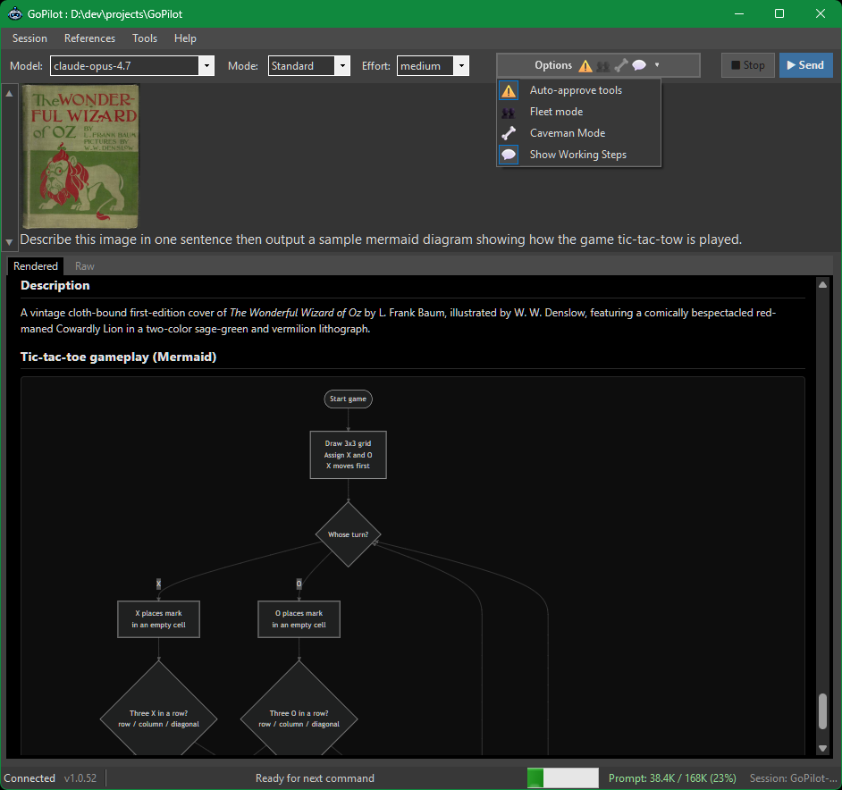

# GoPilot

A Windows desktop GUI for the [GitHub Copilot SDK](libs/copilot-sdk). GoPilot wraps the Copilot CLI in a WinForms window so you can chat, approve tool operations, and manage sessions without working in a terminal.



## Features

- AI Service chooser at every New Session: run the cloud GitHub Copilot model, or point the session at a local OpenAI-compatible server (Lemonade, llama.cpp) on this machine or your network. The Send button reads **Connect** until you pick your model and options.
- Multi-line prompt editor. Enter inserts a newline, Ctrl+Enter (or the Send button) submits.
- Drag and drop files or folders from File Explorer or the VS Solution Explorer onto the prompt.
- Paste clipboard images directly; sent as PNGs, previewed inline.
- Past Sessions dialog to browse, resume, and bulk-delete persisted sessions.
- Model, Mode, Effort, Fleet, and Auto-approve choices persist between launches.
- Rendered and Raw output tabs. Rendered handles Markdown, Mermaid, and syntax-highlighted code.
- Pan, zoom, and fullscreen for oversized diagrams, code blocks, and tables.
- Context meter with an offer to compact or restart at 85% usage.
- Manual session refresh: compact, restart with summary, or fresh start.
- Skill Tree: ordered folders that contribute `skills/`, `agents/`, `prompts/`, and `gopilot-instructions.md` to every session.
- Custom agents and skills auto-discovered and insertable as `@agent:name` / `@skill:name`.
- Plan, Autopilot, and Fleet modes alongside Standard chat.
- Tool Search: defers MCP and external tools behind an on-demand search once the active tool count crosses a threshold, keeping prompts small when several MCP servers are connected.
- MCP Servers manager: attach local (stdio) or HTTP MCP servers to every session, with per-server enable toggles, and auto-discover `.mcp.json` files from the workspace, user, and app folders (e.g. the one the Unreal Engine 5.8 editor generates). The dialog opens automatically at session start when servers are found so you can curate them first.
- Tool permission dialog with Allow / Approve Similar / Deny, plus an Auto-approve toggle.
- Caveman Mode: optional client-side prompt compression to cut tokens.
- Local LLM filter: optional codellama pre-pass (on this machine or any Ollama host on your network) that minimizes prompts and answers simple requests locally to save cloud tokens.
- All option toggles show as badges on the Options button in a fixed order; enabled options appear in full colour and disabled options are greyed out.
- Sending while a turn is in flight interrupts it instead of queueing.
- Dark theme throughout.
- Self-update check.

## Why this exists

I find it difficult to work in a terminal, so I built a Windows app that makes it easier to edit prompts, save and restore session state, and launch tools at the workspace root. Think of it as an alternate front-end for Copilot CLI aimed at people who prefer standard Windows forms and editors. New features added regularly as I think of them :)

## Requirements

- Windows 11 or later
- [.NET 8.0 Runtime](https://dotnet.microsoft.com/download/dotnet/8.0)
- A GitHub account with Copilot access (authenticated via `gh` CLI or environment)
- Remember: You'll need to install the Copilot CLI and run it at least once to login.

## Getting Started

1. Build:
   ```
   dotnet build GoPilot.sln
   ```
2. Run:
   ```
   dotnet run --project GoPilot/GoPilot.csproj
   ```
   Or launch the built `GoPilot.exe`. Pass a folder as the first argument to open it at startup:
   ```
   GoPilot.exe C:\path\to\my\project
   ```
3. Pick a workspace with **Session ▸ 📂 New Session...**. The Send button stays disabled until a workspace is open.
4. Choose your AI service in the dialog that appears - **GitHub Copilot (cloud)** or a **local OpenAI-compatible server** - and optionally the local Filter LLM. See [AI Service](#ai-service).
5. GoPilot connects and lists the available models. Pick your model and options, then press **Connect** to start the session.
6. Type a prompt and press **Send** (or Ctrl+Enter).

## User Interface

The window has a menu bar, a toolbar with the prompt box, an output panel, and a status bar.

### Session menu

| Item | Description |
|---|---|
| 📂 New Session... | Pick a workspace folder and start a fresh session. |
| 📋 Past Sessions... | Browse, resume, or delete persisted sessions. |
| 📝 Summarize | Ask Copilot for a summary of the session so far. |
| 🗑 Clear Output | Clear the panel. The session itself is not reset. |
| 💤 Refresh ▸ | Compact, restart with summary, or fresh start. |

### References menu

Attach files and folders, or insert `@agent:`, `@skill:`, or prompt-file references. Attached files appear as chips above the output and as `@relative/path` tokens at the prompt caret.

### Tools menu

PowerShell, File Explorer, and VS Code at the workspace root. Skill Tree, Skill Sources, and Browse Skill Catalog editors for managing reusable assets. MCP Servers manager for attaching local (stdio) and HTTP MCP servers.

### Toolbar

| Control | Description |
|---|---|
| Model | Pick the AI model. Populated from the chosen AI service once connected. |
| Mode | Standard, Plan, or Autopilot. |
| Effort | Reasoning effort for the selected model when supported. Defaults to the highest available. Hidden for local providers, which do not advertise effort. |
| ⚙ Options ▾ | Session toggles. Active toggles show as coloured badges on the button. |
| ⬛ Stop | Cancel the current response. No-op when nothing is in flight. |
| ▶ Send / Connect | After a New Session the button reads **Connect** and starts the session when clicked. It then becomes **Send** to submit prompts. Shortcut: Ctrl+Enter. See [AI Service](#ai-service). |

Model, Mode, Effort, Fleet, and Auto-approve are persisted to `gopilot.ini` under `[Session]` and restored on the next launch.

### Options dropdown

| Item | Default | Description |
|---|---|---|
| ⚠️ Auto-approve tools | Off | Skip the permission dialog. |
| 👥 Fleet mode | Off | Spawn parallel sub-agents on large tasks. Toggling triggers a summary-and-restart handoff on next send. |
| 🔍 Tool Search | On | Defer MCP and external tools behind an on-demand search once the tool count crosses the threshold. Toggling triggers a summary-and-restart handoff on next send. See [Tool Search](#tool-search). |
| 🦴 Caveman Mode | Off | Compress prompts client-side. See [Caveman Mode](#caveman-mode). |
| 🧠 Local LLM filter | Off | Route prompts through a local codellama model first. See [Local LLM Filter](#local-llm-filter). |
| 🧠 Local LLM settings... | - | Pick the Ollama server (localhost or a network machine by host/IP), model, and confidence threshold. See [Local LLM Filter](#local-llm-filter). |
| 💬 Show Working Steps | Off | Keep Reasoning and Tool sections expanded after they finish. |

### Prompt box

Drag files or folders to attach, paste images from the clipboard, navigate prompt history with the ▲ / ▼ buttons. Right-click for Cut/Copy/Paste plus shortcuts to the References menu.

Sending while Copilot is mid-response interrupts the current turn rather than queueing behind it. The Stop button only acts when something is in flight.

References use the `@` prefix:

| Reference | Inserted via | Meaning |
|---|---|---|
| `@relative/path/to/file.ext` | Add File... or drag-drop | Attach a file. |
| `@relative/path/to/folder` | Add Folder... or drag-drop | Attach a folder. |
| `@agent:name` | List Agents... | Reference a custom agent. |
| `@skill:name` | List Skills... | Reference a skill. |

### Output panel

| Tab | Description |
|---|---|
| Rendered | HTML view (WebView2). Markdown, Mermaid, and syntax-highlighted code. |
| Raw | Plain-text transcript. Useful for copying or as a fallback. |

Mermaid diagrams, wide code blocks, and large tables get a scrollable viewport. Hover for the toolbar (`+`, `-`, `Fit`, `Full`). Mouse wheel zooms, left-drag pans, double-click resets, Esc exits fullscreen.

Color coding (both tabs where applicable): blue for your prompt, green for Copilot's response, yellow for tool activity, red for errors.

### Status bar

Connection status, Copilot version, agent activity, context meter (green below 60%, amber 60-85%, red above), and session info.

## AI Service

Every **Session ▸ 📂 New Session...** opens the **Choose AI Service** dialog before the session is created. It picks the backend for that session and, independently, the local Filter LLM. Your previous choices are shown as the initial selections.

| Choice | What it means |
|---|---|
| **GitHub Copilot (cloud)** | The default. The session runs against the GitHub Copilot cloud model. |
| **Local OpenAI-compatible server** | The session runs against a local/LAN server that speaks the OpenAI API (e.g. [Lemonade](https://github.com/lemonade-sdk/lemonade) or llama.cpp). |

For a local server you supply:

| Field | Notes |
|---|---|
| Host or IP | `localhost`, a LAN host name, or an IP. A pasted `http://host:port` URL or an IPv6 literal in brackets is also accepted. |
| Port | The server's port. |
| API path | The OpenAI base path. Lemonade uses `/api/v1`; llama.cpp uses `/v1`. Defaults to `/api/v1`. |
| API key | Forwarded as a Bearer token. Most local servers accept any non-empty string; defaults to `lemonade`. |
| Context size | The model's prompt window in tokens, used to drive the context meter and auto-compaction. Leave blank to let GoPilot ask the server. |
| Hide these built-in tools | A comma-separated list of built-in tools withheld from the session, to buy back prompt window on a small model. See [Trimming built-in tools](#trimming-built-in-tools). |

The dialog also has a **Filter LLM** section - the same local prompt-reduction/summarizing pre-pass described under [Local LLM Filter](#local-llm-filter). Tick the box to enable it and use **Configure...** to pick the Ollama host, model, and confidence threshold. (The **Options ▸ 🧠 Local LLM filter** toggle remains available too.)

### Trimming built-in tools

Tool definitions are a fixed cost paid on every request, and the system message grows alongside them because it documents the tools. Measured against the CLI's own tokenizer, GoPilot's default tool set costs about 10,700 tokens before a single word of conversation - more than an 8k-window model has to spend at all.

The default trim hides the sub-agent dispatch tools (`task`, `read_agent`, `list_agents`, `write_agent`), taking that fixed cost to roughly 7,600 tokens. Adding `skill` and `sql` takes it to about 6,300. Untick the box to send the full tool set.

The trim applies to local providers only - cloud windows are large enough not to need it - and is **ignored while Fleet mode is on**, because Fleet mode dispatches work through the very sub-agent tools the default trim hides. A local Fleet session therefore pays the full fixed cost with no warning, so on a small model either leave Fleet off or expect very little room for conversation.

If the fixed cost does not fit the window at all, the CLI blocks the turn rather than sending it; GoPilot surfaces that as a warning in the output panel telling you to raise the context size or trim more tools.

### The Connect step

Because the model list depends on the chosen service, GoPilot connects first and lets you pick your model before the session starts:

1. Pick your service (and Filter LLM) and press **OK**.
2. GoPilot starts the CLI client and enumerates the available models from that service, populating the **Model** dropdown. For a local server the list comes from the server's `/models` endpoint; reasoning **Effort** is hidden because local providers do not advertise it.
3. The status panel shows which service is active and the Send button reads **Connect**. Pick your model and options.
4. Press **Connect** (or Ctrl+Enter). GoPilot creates the session with those choices; the button then becomes **Send** and works as normal.

If connecting or starting the session fails, GoPilot reports the error and returns to the **Connect** state so you can adjust the host/port/API path (or check that `copilot` is installed and authenticated) and retry.

Notes:

- The Copilot CLI still drives the session for both services - all skill/agent/MCP/tool machinery is unchanged. A local provider only changes where inference runs.
- The provider is baked in at session creation, so a running session cannot be switched between cloud and local; start a new session to change it.
- The chosen service is recorded per-session, so **Past Sessions ▸ Resume** restores the correct backend. Sessions created before this feature default to Copilot.
- Choices persist in `gopilot.ini` under `[AiService]` (`Provider`, `Endpoint`, `ApiKey`, `Model`, `ContextSize`, `ExcludedTools`); the local model is remembered separately from the cloud model. An absent `ExcludedTools` means the default trim applies; a present but empty one means you switched the trim off.

## Refreshing the Session

| Option | What it does |
|---|---|
| ⚡ Compact (fast) | In-place compaction via `session.history.compact`. Session ID preserved. |
| 🧹 Clear context | Asks the model for a resume note, drops the conversation, and continues in the same session with a fresh window seeded from that note. Session ID preserved. |
| 🔄 Restart with summary | Saves a one-page summary to `%LOCALAPPDATA%\GoPilot\workspaces\<key>\dreams\`, opens a fresh session, seeds it with the summary. |
| 🆕 Fresh start | Discards all context and opens a brand-new session in the same folder. |

At 85% context usage GoPilot offers to compact or restart automatically.

Compact escalates on its own: if `session.history.compact` fails, GoPilot tries Clear context, and only falls back to Restart with summary if that fails too. Each step down the chain keeps less of the session, so the cheapest one that works is the one that runs.

### Clear context

Compaction hands the conversation back to the model and asks it to shrink it, which is only as good as the model doing the shrinking - a weak spot for a small local model. Clearing takes the opposite approach: GoPilot asks for a one-page resume note, then has the runtime **discard the conversation outright** and start a fresh window seeded with that note. The system message, the tool definitions, the session ID and the session's place in Past Sessions all survive; only the conversation goes.

The note is saved to the workspace's `dreams\` folder like a Restart summary, tagged `gopilot-source: clear-context`.

The runtime only permits a clear from inside a tool handler, because it has to discard the tool results its own wipe would orphan. GoPilot therefore exposes a `clear_context` tool (about 50 tokens of tool definition) and asks the model to call it with the resume note. That means the model has to co-operate: if it answers in prose instead of calling the tool, nothing is cleared and GoPilot falls back to Restart with summary. The tool is marked terminal, so a successful clear ends the turn rather than feeding a reply back into a conversation that no longer exists; the runtime then delivers the seeded note as the first message of the new window.

Changing Mode or toggling Fleet during an active session forces a new session (the system message is baked in at creation). Rather than discarding context, GoPilot defers the reset: on the next send it runs the same summary-and-restart flow, then forwards the prompt to the fresh session.

## Past Sessions

Every session GoPilot creates gets a stable ID of the form `{LeafFolder}-{MM-dd-yyyy-HHmmss}` (e.g. `GoPilot-04-24-2026-211734`). Metadata (workspace, model, mode, fleet, auto-approve, timestamp, first-prompt description) is recorded in `gopilot-sessions.json` next to the executable.

**Session ▸ 📋 Past Sessions...** opens a list of every persisted session with columns for Session ID, Workspace, Model, Mode, Created, and Description.

- **Resume** restores the recorded settings, opens the workspace, reconnects via `ResumeSessionAsync`, and replays the conversation into both output tabs.
- **Delete** removes the session from the SDK store, deletes its scratch folder under `~/.copilot/session-state/<id>/`, and drops the row from the local metadata file. Multi-select is supported. The `Delete` key is a shortcut.
- The current session shows as `(current)` and is protected from Resume and Delete.
- Stale local metadata is pruned automatically every time the dialog opens.

## Modes

| Mode | Behaviour |
|---|---|
| Standard | Direct conversational chat. |
| Plan | Plan a sequence of actions before executing them. |
| Autopilot | Fully autonomous execution with minimal prompting. |

## Fleet Mode

With Fleet on, Copilot can spawn parallel sub-agents on different parts of a task. The output panel shows each agent's progress; the session completes when the last sub-agent finishes. Best for large refactors and tasks that decompose cleanly.

Fleet mode and the local-provider tool trim are mutually exclusive: because Fleet dispatches work through the sub-agent tools that the trim hides, GoPilot silently skips the trim whenever Fleet is on. A local session with Fleet enabled therefore pays the full built-in tool overhead - see [Trimming built-in tools](#trimming-built-in-tools).

## Tool Search

Tool Search keeps the model's active tool set small. When the number of available tools crosses a threshold (default 30), MCP and external tools are deferred and surfaced on demand through the runtime's built-in `tool_search_tool`, instead of being pre-loaded into every prompt. This trims token usage when you connect several MCP servers at once.

- **On (default):** matches the Copilot runtime default. Recommended when you attach multiple MCP servers or large tool sets.
- **Off:** every tool stays resident in each prompt (useful for small, fixed tool sets where you never want a search round-trip).

Tool Search is applied when a session is created or resumed, so toggling it mid-session triggers the same summary-and-restart handoff used by Mode and Fleet changes. The toggle and threshold are persisted in `gopilot.ini` under `[ToolSearch]` (`Enabled=true|false`, `DeferThreshold=<count>`); edit `DeferThreshold` there to tune when deferral kicks in.

Tool Search works on the combined tool set from GoPilot's own MCP Servers (below), any MCP servers the Copilot CLI discovers, and built-in tools.

## MCP Servers

**Tools ▸ 🔌 MCP Servers...** manages the [Model Context Protocol](https://modelcontextprotocol.io) servers GoPilot attaches to every session it creates or resumes. Two transports are supported:

| Transport | Use for | Key fields |
|---|---|---|
| Local process (stdio) | A server launched as a command on this machine (e.g. the Unreal Engine 5.8 MCP server). | Command (executable), Arguments (one per line), Working directory, Environment (`KEY=VALUE`, one per line). |
| HTTP | A server reachable at a URL. | URL, Headers (`KEY=VALUE`, one per line). |

- Each row has an **enable** checkbox: untick to stop loading that server.
- **Add...** / **Edit...** / **Remove** manage your own entries.
- **Discovered servers** are found automatically in a `.mcp.json` file in any of the same folders GoPilot searches for instruction/config files: the **workspace** folder, your **user** folder, and the **GoPilot app** folder (the one holding `gopilot.ini`). `.mcp.json` is the standard client-config format written by tools such as **Unreal Engine** (`ModelContextProtocol.GenerateClientConfig`), Claude Code, Cursor, and VS Code - so enabling the Unreal MCP server is just: generate the file in the editor, open that project in GoPilot, and go. Discovered rows are read-only (shown with their source `.mcp.json` path in the **Source** column and below the list) but can be unticked to disable them; workspace files win name collisions over user/app files, and discovered servers override same-named manual entries.
- **At the start of every new session** - before the README prompt and before the session is created - GoPilot opens this dialog automatically **if any `.mcp.json` server was discovered**, so you can toggle off anything unwanted (or add your own) before it loads. If nothing was discovered, it stays out of the way.
- As each session starts, GoPilot reports the load result for every server in the output panel (e.g. `[MCP] unreal-mcp (http): connected`, `[MCP] adopted 'unreal-mcp' from C:\proj\.mcp.json (http)`, or a failure with the server's error text).

Manual servers are persisted in `gopilot.ini` under `[McpServers]` as one base64-encoded JSON token per `Server=` line; disabled discovered servers are stored there as `Disabled=<name>` lines. Discovered servers themselves are read fresh from disk each session (never copied into `gopilot.ini`). Because servers are read at session creation, changing them from the Tools menu on a live session triggers the same summary-and-restart handoff used by Skill Tree and Fleet changes.

GoPilot's servers are additive to whatever the Copilot CLI already discovers from its own configuration; when the combined tool count is large, enable **Tool Search** to keep prompts small.

## Skill Tree

**Tools ▸ 🌳 Skill Tree...** edits an ordered list of folders that contribute reusable assets to every session GoPilot starts. For each folder:

| Subfolder | Effect |
|---|---|
| `skills/` | Added to the session's `skillDirectories`. |
| `agents/` | Each `*.md` file is parsed into a custom agent. |
| `prompts/` | Each `*.md` file becomes a named prompt template surfaced through References ▸ List Prompts... |

A `gopilot-instructions.md` file at the root of a Skill Tree folder is concatenated into the system message. The list is persisted in `gopilot.ini` under `[SkillTree]`. Order matters: later entries override earlier ones on name collisions, and the project folder always wins overall.

Editing the Skill Tree triggers the same summary-and-restart handoff used by Mode and Fleet changes, because skills and agents are baked in at session creation. Prompts are picked up live since they are attached at send time.

## Caveman Mode

When on, GoPilot rewrites each outgoing prompt into a token-minimal form before it reaches the model, and asks the model to reply in the same style. The reduced prompt is what shows as your `👤 You:` echo; there is no hidden rewrite.

- Strips articles, prepositions, auxiliaries, filler words, pleasantries, hedges, polite-clause openers, leading subjects, `-ly` adverbs, and decorative punctuation.
- Preserves negations, fenced code blocks, inline backticks, `@references`, URLs, and any line whose first non-whitespace characters are `!!` (the marker is stripped).
- Number words 1-20, 30-90, and hundred/thousand/million/billion are converted to digits.

After each send a discreet meta line reports the before/after character count. Typical prose savings are 10-20%. Code-heavy prompts will see little or none.

Toggling Caveman mid-session sends a single `CAVEMAN MODE ON.` or `CAVEMAN MODE OFF.` side instruction so the model switches style on its next reply without a session restart. The setting is persisted in `gopilot.ini` under `[Caveman]`.

## Local LLM Filter

An optional pre-processor (powered by [OllamaSharp](https://github.com/awaescher/OllamaSharp)) that sits between you and the cloud model to cut token spend. The Ollama server can run on this machine *or* on another machine on your home network:

- **Minimize:** every prompt is rewritten to the fewest tokens that preserve intent (code, paths, and names kept verbatim) before being forwarded to the cloud, with a short directive telling the cloud model to answer concisely - response tokens are the costliest, so this is where most AIC is saved.
- **Answer locally:** when the local model is confident enough (default threshold 0.85) it answers directly and the cloud is skipped entirely - zero cloud tokens, zero AIC.

### Choosing the server

**Options > Local LLM settings...** opens a dialog where you set:

| Field | Meaning |
|---|---|
| Server host or IP | `localhost` for this machine, or the host name / IP of another machine on your network (e.g. `192.168.1.50`). A full `http://host:port` URL is also accepted. |
| Port | Ollama's port (default `11434`). |
| Model | A model installed on that server, or blank to auto-detect. |
| Answer-locally confidence | Threshold (0.00 - 1.00) the local model must clear to answer without the cloud. |

Changing the server or model re-detects against the new target immediately when the filter is on; the status line reports the chosen model and host, e.g. `Local filter: ready (codellama:13b-instruct @ 192.168.1.50)`.

When **Model** is blank, GoPilot auto-detects dedicated VRAM (via `nvidia-smi`, falling back to the registry) and picks a fitting model: `codellama:7b-instruct` (~8GB), `codellama:13b-instruct` (~16GB), or `codellama:34b-instruct` (24GB+). VRAM describes *this* machine, so when the server is remote GoPilot instead prefers a codellama model already installed on that host. The cloud always receives the original prompt if the filter is off, unavailable, or errors.

### Setup

The filter is optional. If you don't run Ollama, GoPilot ignores it and works normally - prompts go straight to the cloud, with one "unavailable" status line when toggled.

1. Install Ollama from [ollama.com](https://ollama.com) and let it run. By default it serves on `localhost:11434`; to reach it from other machines, start it with `OLLAMA_HOST=0.0.0.0:11434` and allow the port through that machine's firewall.
2. Pull a model on the server that will run it: `ollama pull codellama:13b-instruct` (or 7b/34b to match its VRAM).
3. If the server is on another machine, open **Options > Local LLM settings...** and enter its host/IP (and model).
4. Enable **Options > Local LLM filter**. When GoPilot finds the model it shows `Local filter: ready`; otherwise it bypasses and forwards your prompt unchanged.

Settings persist in `gopilot.ini` under `[LocalFilter]` (`Enabled`, `Endpoint`, `Model`, `Threshold`); leave `Model` blank for auto-selection.

## Tool Permission Dialog

When Copilot wants to run an operation and Auto-approve is off, a dialog appears:

| Button | Effect |
|---|---|
| ✓ Allow | Approve this one operation. |
| ✓ Approve Similar | Approve all future operations of the same type for the session. |
| ✗ Deny | Reject; Copilot adjusts. |

Operation types include shell commands, file I/O, MCP tool calls, URL fetches, memory access, and hook invocations.

## User Input Dialog

If Copilot asks a question mid-task, a dialog appears with the question and any predefined choices. Pick one or type a custom answer, then press Submit or Enter.

## Keyboard Shortcuts

| Shortcut | Action |
|---|---|
| Ctrl+Enter | Send prompt |
| Enter (in input dialog) | Submit answer |
| Delete (in Past Sessions) | Delete selected sessions |
| Esc | Close dialogs / exit fullscreen view |
| Alt+S / Alt+R / Alt+T / Alt+H | Open Session / References / Tools / Help menu |

Menu items with an underlined letter can be triggered with Alt+letter once their parent menu is open.

## Tips

- Open a folder and ask "What does this project do?" to get oriented.
- Use Plan mode for big tasks so you can review the plan before Copilot acts.
- Summarize before switching topics (Session ▸ 📝 Summarize).
- Watch the context meter. Amber at 60%, auto-refresh offer at 85%.
- Resume earlier work via Session ▸ 📋 Past Sessions...
- Switch to the Raw tab if a rendered block is not displaying as expected.
- For large Mermaid charts, hover and click Full or use the wheel to zoom.

---
If you enjoy this tool, please consider:

<a href="https://www.buymeacoffee.com/mighty_studios" target="_blank">
  
</a>

<small>(The joy I get from a free latte is incredible)</small> 

